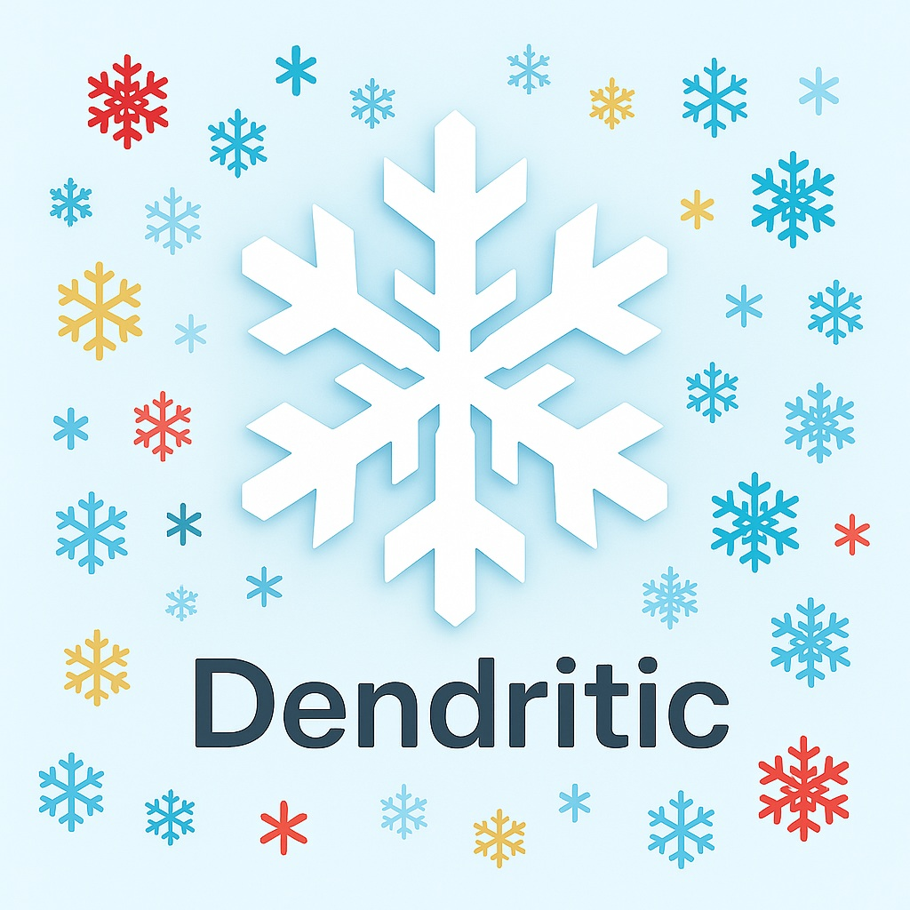

# The Dendritic Pattern

A [Nixpkgs module system](https://nix.dev/tutorials/module-system/) usage pattern

Includes [an annotated example](example)

## Testimonials

> I adore this idea by @mightyiam of every file is a flake parts module and I think I will adopt it everywhere.

—Daniel Firth ([source](https://x.com/locallycompact/status/1909188620038046038))

> Massive, very interesting!

—Pol Dellaiera ([source](https://discourse.nixos.org/t/pattern-every-file-is-a-flake-parts-module/61271/2?u=mightyiam))

> I’ve adopted your method. Really preferring it.

—gerred ([source](https://x.com/devgerred/status/1909206297532117469))

## Background

[NixOS](https://nixos.org/manual/nixos/unstable/),
[home-manager](https://github.com/nix-community/home-manager) and
[nix-darwin](https://github.com/nix-darwin/nix-darwin)
are popular projects that allow the user to produce [derivations](https://nix.dev/tutorials/nix-language.html#derivations)
that can be customized by evaluating a [Nixpkgs module system](https://nix.dev/tutorials/module-system/) configuration.

Figuring out a practical and expressive architecture for a codebase that provides configurations had proven to cost many a Nix user numerous rounds of re-architecturing.

Factors contributing to the complexity of the matter:

- Multiple configurations
- Sharing of modules across configurations
- Multiple configuration classes (`nixos`, `home-manager`, etc.)
- Configuration nesting such as home-manager [within NixOS](https://nix-community.github.io/home-manager/index.xhtml#sec-install-nixos-module) or [within nix-darwin](https://nix-community.github.io/home-manager/index.xhtml#sec-install-nix-darwin-module)
- Cross-cutting concerns that span multiple configuration classes
- Accessing values such as functions, constants and packages across files

## The pattern

The dendritic pattern reconciles these factors using yet another application of the Nixpkgs module system—a *top-level configuration*.
The top-level configuration facilitates the declaration and evaluation of lower-level configurations, such as NixOS, home-manager and nix-darwin.

Commonly, this top-level configuration is a [flake-parts](https://flake.parts) configuration,
but it does not have to be.
Alternatives to flake-parts may exist.
Also, the module system can be used directly via (`lib.evalModules`).

In the dendritic pattern every Nix file is a module of the top-level configuration.
In other words, every Nix file is
a Nixpkgs module system module that is imported directly into the evaluation of the top-level configuration.
Every Nix file also

- implements a single feature
- ...across all configurations that that feature applies to
- is at a path that serves to name that feature

The pattern typically involves storing lower-level configurations and modules
such as NixOS, home-manager and nix-darwin
as option values in the top-level configuration.
Pervasively, the lower-level module options are of the type `deferredModule` that is inlcuded in Nixpkgs.
A primary benefit of this type to the pattern are its value merge semantics.
Lower-level modules take part in the evaluation of any number of lower-level configurations.
flake-parts includes an optional module for storing lower-level modules:
[`flake-parts.modules`](https://flake.parts/options/flake-parts-modules.html).

## Benefits

### Type of every file is known

The common question "what's in that Nix file?" is made irrelevant.
They each contain a Nixpkgs module system module
of the same [`class`](https://nixos.org/manual/nixpkgs/stable/#module-system-lib-evalModules-param-class)
as the top-level configuration.

### Automatic importing

Since all files are top-level modules
and their paths convey meaning only to the author,
they can all be automatically imported using a trivial expression
or [a small library](https://github.com/vic/import-tree).

### File path independence

In some patterns file paths are significant to some particular detail,
such as the type of the expression the file contains
or what specific configuration it belongs to.

Contrary to those, in this pattern a file path represent a feature.
Each file can be freely renamed and moved,
and it can be split when it grows too large or too complex.

## Required skills

- [Nix language](https://nix.dev/tutorials/nix-language)
- [Nixpkgs module system](https://nix.dev/tutorials/module-system/)
- [The `deferredModule` type](https://nixos.org/manual/nixos/stable/#sec-option-types-submodule)

## Real examples

- [Shahar "Dawn" Or (@mightyiam)](https://github.com/mightyiam/infra) ([adoption commit](https://github.com/mightyiam/infra/commit/b45e9e13759017fe18950ccc3b6deee2347e9175))
- [Victor Borja (@vic)](https://github.com/vic/vix) ([adoption pull request](https://github.com/vic/vix/pull/115)) ([forum answer](https://discourse.nixos.org/t/how-do-you-structure-your-nixos-configs/65851/8))
- [Pol Dellaiera](https://github.com/drupol/nixos-x260) ([adoption pull request](https://github.com/drupol/nixos-x260/pull/83)) ([blog post](https://not-a-number.io/2025/refactoring-my-infrastructure-as-code-configurations/))
- [Horizon Haskell](https://gitlab.horizon-haskell.net/nix/gitlab-ci)
- [Gaétan Lepage](https://github.com/GaetanLepage/nix-config) ([acknowledgment commit](https://github.com/GaetanLepage/nix-config/commit/3ed89eae1a8e13c1910eac5f89f2cdb4f48756ff))
- [bivsk](https://github.com/bivsk/nix-iv) ([adoption pull request](https://github.com/bivsk/nix-iv/pull/2))
- [Michael Belsanti](https://tangled.org/belsanti.xyz/nixconfig/tree/den)

## See also

- [vic/dendrix/Dendritic](https://vic.github.io/dendrix/Dendritic.html) - on the benefits of the pattern
- [vic/den](https://github.com/vic/den) - aspect-oriented dendritic framework
- [vic/dendritic-unflake](https://github.com/vic/dendritic-unflake) - non-flake, non-flake-parts examples

## Community

- [GitHub Discussions](https://github.com/mightyiam/dendritic/discussions)

- [Matrix room: `#dendritic:matrix.org`](https://matrix.to/#/#dendritic:matrix.org)

## Anti patterns

### `specialArgs` pass-thru

In a non-dendritic pattern some Nix files may be modules that are lower-level
(such as NixOS or home-manager).
Often they require access to values that are defined outside of their config evaluation.
Those values are often passed through to such evaluations
via the `specialArgs` argument of `lib.evalModules` wrappers like `lib.nixosSystem`.

For example, `scripts/foo.nix` defines a script called `script-foo`
which is then included in `environment.systemPackages` in `nixos/laptop.nix`.
`script-foo` is made available in `nixos/laptop.nix` by injecting it
(or a superset of it, such as the flake `self` may be) via `specialArgs`.
This might occur even once deeper from the NixOS evaluation into a nested home-manager evaluation
(this time via `extraSpecialArgs`).

In the dendritic pattern
every file is a top-level module and can therefore add values to the top-level `config`.
In turn, every file can also read from the top-level `config`.
This makes the sharing of values between files seem trivial in comparison.
