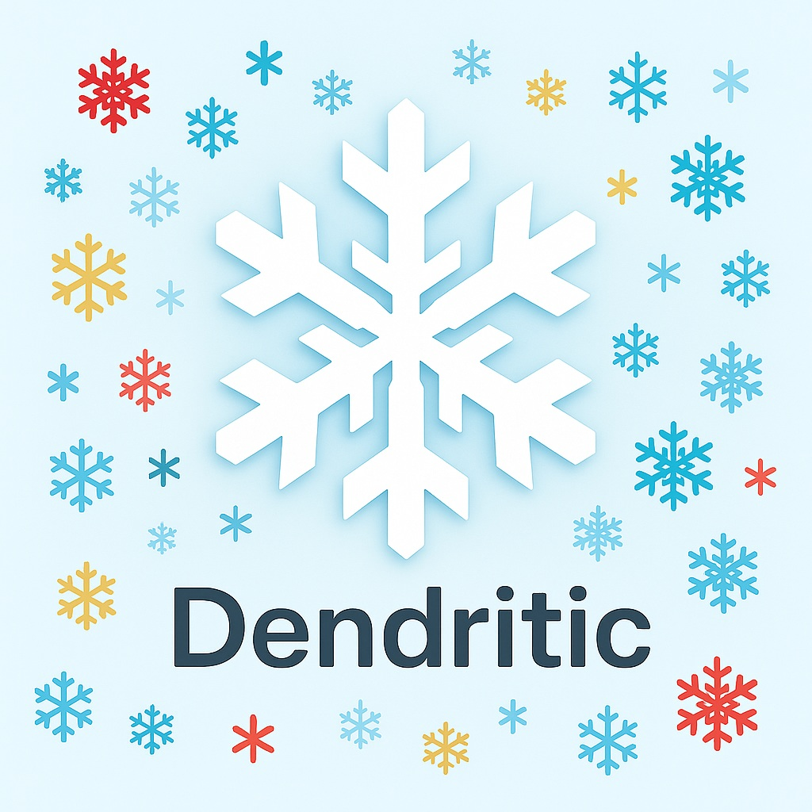

<a id="readme-top"></a>
<div align="center">

[![Contributors][contributors-shield]][contributors-url]
[![Forks][forks-shield]][forks-url]
[![Stargazers][stars-shield]][stars-url]
[![Issues][issues-shield]][issues-url]
[![MIT License][license-shield]][license-url]

</div>

<!-- PROJECT LOGO -->
<br />
<div align="center">
  <a href="https://github.com/mightyiam/dendritic">
    
  </a>

  <h3 align="center">The Dendritic Pattern</h3>

  <p align="center">
    A <a href="https://nix.dev">Nix</a> <a href="https://flake.parts">flake-parts</a> usage pattern in which <i>every</i> Nix file is a flake-parts module
    <br />
    <a href="https://github.com/mightyiam/dendritic"><strong>Explore the docs »</strong></a>
    <br />
    <br />
    <a href="https://github.com/mightyiam/dendritic">View Example</a>
    &middot;
    <a href="https://github.com/mightyiam/dendritic/issues/new?labels=bug&template=bug-report---.md">Report Bug</a>
    &middot;
    <a href="https://github.com/mightyiam/dendritic/issues/new?labels=enhancement&template=feature-request---.md">Request Feature</a>
  </p>
</div>

## Testimonials

> I adore this idea by @mightyiam of every file is a flake parts module and I think I will adopt it everywhere.

—Daniel Firth ([source](https://x.com/locallycompact/status/1909188620038046038))

> Massive, very interesting!

—Pol Dellaiera ([source](https://discourse.nixos.org/t/pattern-every-file-is-a-flake-parts-module/61271/2?u=mightyiam))

> I’ve adopted your method. Really preferring it.

—gerred ([source](https://x.com/devgerred/status/1909206297532117469))

## About The Project

[NixOS](https://nixos.org/manual/nixos/unstable/),
[home-manager](https://github.com/nix-community/home-manager) and
[nix-darwin](https://github.com/nix-darwin/nix-darwin)
are popular projects that allow the user to produce [derivations](https://nix.dev/tutorials/nix-language.html#derivations)
that can be customized by evaluating a [Nixpkgs module system](https://nix.dev/tutorials/module-system/) configuration.

Figuring out a practical and expressive architecture for a codebase that provides configurations had proven to cost many a Nix user protracted periods and multiple refactorings.

Factors contributing to the complexity of such an architecture:

- Multiple configurations
- Sharing of some modules across some configurations
- Multiple configuration classes (NixOS & home-manager)
- Configuration nesting such as home-manager [within NixOS](https://nix-community.github.io/home-manager/index.xhtml#sec-install-nixos-module) or [within nix-darwin](https://nix-community.github.io/home-manager/index.xhtml#sec-install-nix-darwin-module)
- Existence of concerns that span multiple configuration classes ("cross-cutting concerns")
- Accessing values such as functions, constants and packages across files

### The pattern

The dendritic pattern reconciles these factors using yet another application of the Nixpkgs module system: [flake-parts](https://flake.parts).
Especially its option [`flake.modules`](https://flake.parts/options/flake-parts-modules.html).

Each and every file:
- is a flake-parts module
- implements a single feature
- ...across all module classes it applies to
- is at a path that serves to name the feature

### Anti patterns

### `specialArgs` pass-thru

In a non-dendritic pattern some Nix files may be modules that are other than flake-parts
(such as NixOS or home-manager).
Often they require access to values that are defined outside of their config evaluation.
Those values are often passed through to such evaluations
via the `specialArgs` argument of `lib.evalModules` wrappers like `lib.nixosSystem`.

For example, `scripts/foo.nix` defines a script called `script-foo`
which is then included in `environment.systemPackages` in `nixos/laptop.nix`.
`script-foo` is made available in `nixos/laptop.nix` by injecting it
(or a superset of it, such as the flake `self` may be) via `specialArgs`.
This might occur even once deeper from the NixOS evaluation into a nested home-manager evaluation
(this time via `extraSpecialArgs`).

In the dendritic pattern
every file is a flake-parts module and can therefore add values to the flake-parts `config`.
In turn, every file can also read from the flake-parts `config`.
This makes the sharing of values between files seem trivial in comparison.
## Getting Started

### Prerequisites

- Nix with flakes enabled
- Basic understanding of flake-parts
- Familiarity with NixOS/home-manager modules

### Usage with import-tree

The dendritic pattern uses **import-tree** to automatically discover and import all `.nix` files in your directory tree[1]. This eliminates manual imports and lets you organize features freely.

### Basic Setup `flake.nix`

```nix
{
  inputs.import-tree.url = "github:vic/import-tree";
  inputs.flake-parts.url = "github:hercules-ci/flake-parts";

  outputs = inputs: inputs.flake-parts.lib.mkFlake { inherit inputs; } 
    (inputs.import-tree ./modules);
}
```

### Structure

```
flake.nix
modules/
├── git.nix              # Git config for all systems
├── ssh.nix              # SSH setup across NixOS + home-manager
├── catppuccin.nix       # Theme applied everywhere
├── languages/
│   └── rust.nix         # Rust development environment
└── hosts/
    └── laptop.nix       # Laptop-specific configuration
```

### Cross-cutting Example `modules/ssh.nix`

```nix
{ config, ... }: {
  # NixOS system SSH daemon
  nixosConfigurations.laptop.config.services.openssh.enable = true;
  
  # Home-manager SSH client config
  home-manager.users.dawn.programs.ssh = {
    enable = true;
    matchBlocks."server" = {
      hostname = "192.168.1.100";
      user = "admin";
    };
  };
}
```

**import-tree** recursively imports all `.nix` files from the `modules/` directory, so `ssh.nix` can configure both system and user SSH without manual imports[1]. Files can be moved and nested freely - import-tree handles discovery automatically. Files beginning with underscore are ignored for development work[1].

All files share the same flake config, enabling cross-cutting concerns like theming or SSH to work across NixOS, home-manager, and other module systems from a single file.

While import-tree provides an excellent starting point for beginners to achieve automatic file discovery in the dendritic pattern, it's worth noting that this auto-import functionality can be implemented through various approaches - import-tree simply offers one of the most straightforward solutions for those new to organizing Nix configurations this way.

## Usage in the wild

- [Shahar "Dawn" Or (@mightyiam)](https://github.com/mightyiam/infra) ([adoption commit](https://github.com/mightyiam/infra/commit/b45e9e13759017fe18950ccc3b6deee2347e9175))
- [Victor Borja (@vic)](https://github.com/vic/vix) ([adoption pull request](https://github.com/vic/vix/pull/115))
- [Pol Dellaiera](https://github.com/drupol/nixos-x260) ([adoption pull request](https://github.com/drupol/nixos-x260/pull/83)) ([blog post](https://not-a-number.io/2025/refactoring-my-infrastructure-as-code-configurations/))
- [Horizon Haskell](https://gitlab.horizon-haskell.net/nix/gitlab-ci)

<p align="right"><a href="#readme-top">▲</a></p>

<!-- MARKDOWN LINKS & IMAGES -->
[contributors-shield]: https://img.shields.io/github/contributors/mightyiam/dendritic.svg?style=for-the-badge
[contributors-url]: https://github.com/mightyiam/dendritic/graphs/contributors
[forks-shield]: https://img.shields.io/github/forks/mightyiam/dendritic.svg?style=for-the-badge
[forks-url]: https://github.com/mightyiam/dendritic/network/members
[stars-shield]: https://img.shields.io/github/stars/mightyiam/dendritic.svg?style=for-the-badge
[stars-url]: https://github.com/mightyiam/dendritic/stargazers
[issues-shield]: https://img.shields.io/github/issues/mightyiam/dendritic.svg?style=for-the-badge
[issues-url]: https://github.com/mightyiam/dendritic/issues
[license-shield]: https://img.shields.io/github/license/mightyiam/dendritic.svg?style=for-the-badge
[license-url]: https://github.com/mightyiam/dendritic/blob/master/LICENSE.txt
